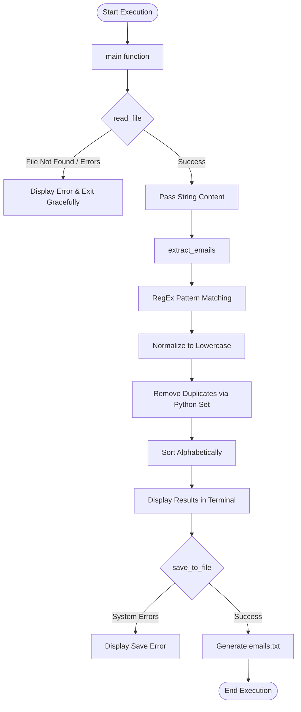

# Email Extraction Automation Script

An automated, clean, and modular Python script designed to extract, validate, and deduplicate email addresses from raw text files. Built entirely with Python's standard libraries, this project demonstrates clean code practices, robust error handling, and automation principles.


## 📌 Overview

In real-world data processing, we often encounter messy log files, disorganized text dumps, or scattered documents containing valuable contact information. This script automates the extraction process by traversing unstructured data, identifying email addresses using Regular Expressions, removing any duplicate entries, and outputting a clean, alphabetically sorted list.

## ✨ Features

- **Zero Dependencies**: Uses only standard Python libraries (`re`, `sys`). No external packages required.
- **Robust Pattern Matching**: Safely extracts standard and complex email formats (e.g., `user+tag@domain.co.uk`) using RegEx.
- **Data Normalization**: Automatically converts emails to lowercase and removes duplicates (case-insensitive deduplication).
- **Alphabetical Sorting**: Generates output that is alphabetical and easy to review.
- **Resilient Error Handling**: Gracefully catches missing files, empty files, and permission errors without crashing suddenly or throwing unreadable stack traces.
- **Automated CLI Output**: Prints visual, shell-friendly execution summaries.

- ## ⚙️ How It Works (Workflow)

The execution flows through specific modular functions without requiring manual user input. 



## 🚀 Usage Guide

### 1. Prepare your input
Ensure you have an `input.txt` file in the same directory as the script. You can dump any raw text, paragraphs, or messy data containing emails into this file.

### 2. Run the Script
Open your terminal and execute:
```bash
python email_extractor.py
```

### 3. Review the Output
- The script will display the total number of unique emails found directly in the terminal.
- A new file named `emails.txt` will be automatically generated in the same directory containing the sorted clean data.

- ## 📂 Project Structure

```text
📁 task-automation/
│
├── 📄 email_extractor.py   # The main modular automation script
├── 📄 input.txt            # The source dummy data (Unstructured text)
└── 📄 emails.txt           # The generated sorted unique emails (Output)
```

## 🧠 Code Architecture

The script strictly follows the "Single Responsibility Principle" using four distinct functions:
- `read_file(filepath)`: Handles secure file I/O operations and validations.
- `extract_emails(text)`: Core regex engine doing the parsing, normalization, and deduplication.
- `save_to_file(emails, output_filepath)`: Handles file creation and writing the final dataset safely.
- `main()`: Orchestrates the pipeline and formats the user CLI experience.

---
*Created as a demonstration of clean coding and task automation in Python.*
